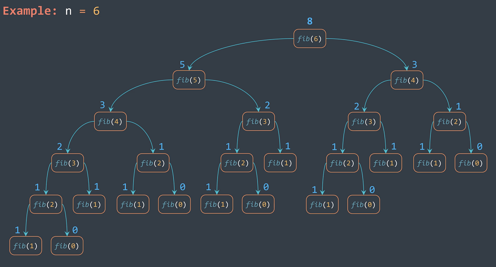
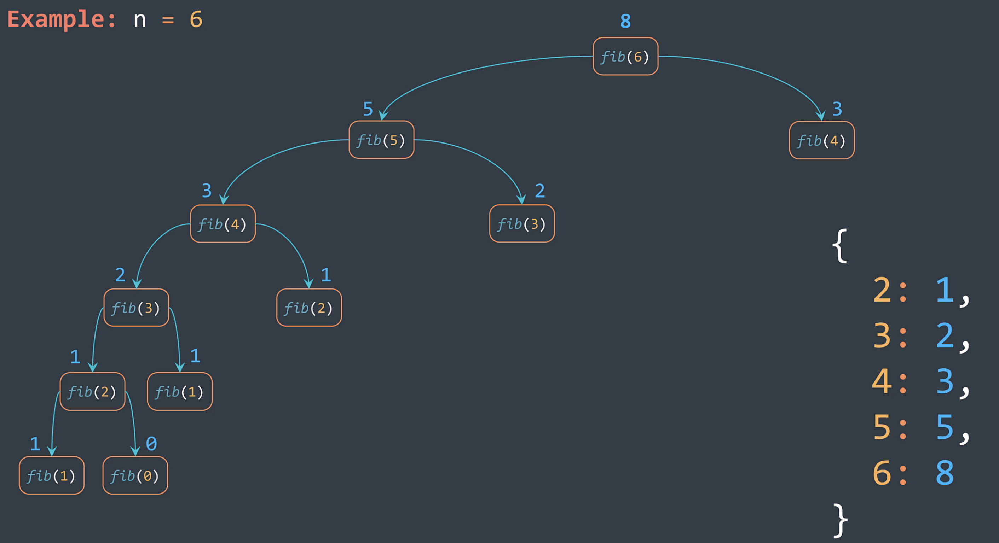

# Dynamic Programming Introduction

Dynamic programming (DP) is a technique that is used to optimize a recursive solution that does repeated work, it operates by storing results to intermediate subproblems to avoid solving them more than once. 

## Reminder on Recursion: 
Time Complexity = O(Φ^n) while Φ estimates to 1.618. 

## Approaches: 
* Top-Down approach (Memorization)
* Bottom-Up approach (Tabulation)

### Top-Down Apprach: 
**Let's look at the famous fibonacci sequence using recursion.**

If we do not check whether the subproblem is solved, we have something like this: 
```python 
def fib(n): 
    if n == 0: 
        return 0
    elif n == 1: 
        return 1
    else: 
        return fib(n - 1) + fib(n - 2)
```

**_However, this causes certain subproblems to be ran multiple times._** Refer to the graph below: 

Notice how **fib(4)** and below were ran multiple times. 

```python
def fib(n, lookup=None):
    lookup = {} if lookup is None else lookup
    #Check if we haven't solved the problem before. 
    if n in lookup:
        return lookup[n]
    if n == 0: 
        return 0
    elif n == 1: 
        return 1
    else: 
        #Add the result of the subproblem to the lookup table. 
        lookup[n] = fib(n - 1) + fib(n - 2)
        return fib(n - 1) + fib(n - 2) 
```

We will need to use hashtable here for lookup. It will look something like this: 
```python
{
    subproblem1_key : subproblem1_result, 
    subproblem2_key : subproblem2_result, 
    subproblem3_key : subproblem3_result, 
}
```

With the help of lookup, the graph could be reduced to this: 


### Bottom-Up Approach: 
Again, we will look at the fibonacci sequence. Using the bottom-up approach, we get something like this: 
```python
def fib(n): 
    dp = [0] * (n + 1)
    dp[0] = 0
    dp[1] = 1
    for i in range(2, len(dp)): 
        dp[i] = dp[i - 1] + dp[i - 2]
    return dp[n]
```

## How to solve almost any DP problem: 
Reminder: Directed Acyclic Graph (DAG) is a directed graph that doesn't contain any cycle. 
